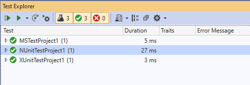

# dotNet5TestFrameworkDifference

This project contains one class library for .NET 5. Test the class library with xUnit and NUnit and MSTest test projects.

## Prerequisites

- Visual Studio 2019
- .NET 5 SDK

## Running the tests

### Visual Studio

Open Test Explorer and Run.



### CLI

```bash
dotnet test

# Passed!  - Failed:     0, Passed:     1, Skipped:     0, Total:     1, Duration: 10 ms - MSTestProject1.dll (net5.0)
# Passed!  - Failed:     0, Passed:     1, Skipped:     0, Total:     1, Duration: 11 ms - NUnitTestProject1.dll (net5.0)
# Passed!  - Failed:     0, Passed:     1, Skipped:     0, Total:     1, Duration: 4 ms - XUnitTestProject1.dll (net5.0)
```
